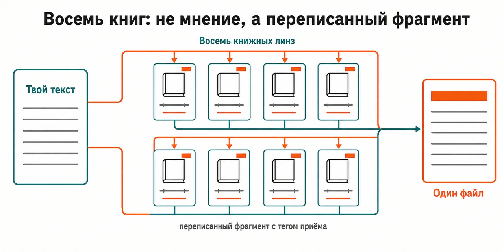
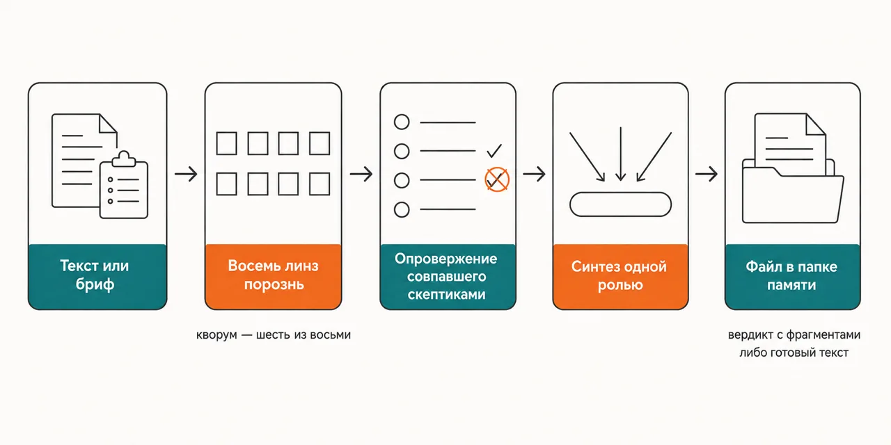

English · [Русский](README.md)

# You have reread your own copy so many times that your eye catches typos, not the place where the reader leaves

Eight copywriting books take the text apart separately, each answering only out of its own, and hand
back rewritten fragments as "before → after" with the tag of the technique — or, in the second mode,
first write three drafts through different lenses and assemble the final one from the best parts.

```
claude plugin marketplace add https://github.com/beCyborg/jadlis-start.git
claude plugin install advisor-copywriting@jadlis
```

There are no keys and no paid third-party subscriptions; you are asked for one thing — `MEMORY_DIR`,
the council's memory folder where finished texts, verdicts and the run log will live.



In words: on the left your text as one block, on the right eight book lenses, each returning not an
opinion but a rewritten fragment with the tag of the technique, and all of it landing in one file.

This is my workbench published as it is, not a product: whatever I stopped using, I removed.

## Before → after

| By hand | With an AI chat | With this plugin |
|---|---|---|
| **Who reads the text before it ships.** The reader is the person who wrote it: what gets fixed is what stands out, not what stops the sale. | One voice answers and picks up the frame of your question: you asked about the headline, you get the headline. | Eight books take the text apart in parallel and never see each other's answers; a separate validator role brings them into one verdict. |
| **Where a fix came from.** A fix arrives as "it feels wrong to me" — there is nothing to argue with. | The fix sounds confident, and what it stands on is never shown. | Every technique carries a tag like `[ADW:xx]` or `[BTA:xx]` — it points at a block of the digest inside the plugin, so the fix can be opened and disputed. |
| **What happens to what the books agree on.** Agreement has nowhere to come from: there is one source. | Agreement with itself is added with every follow-up question. | Matching and disputed statements go to skeptics whose job is to refute them; what gets refuted never reaches the "What to strengthen" section. |
| **The age of a book's advice.** An example from the direct-mail era reads as today's: the book does not say when it went stale. | Eras get mixed inside one paragraph. | Each of the eight lenses carries its known bias, and the validator lowers the weight and prints Bias flags: it carries Schwartz's mechanics over but does not quote his era's cases as current, and discounts Cashvertising's tilt toward fear wherever the tone is soft. |
| **How a new text gets written.** You write one draft and edit that same draft — there is nothing to compare it with. | The second version turns out to be the same text in other words. | The writing mode produces three drafts through different lenses — a direct-response formula, a lead matched to the awareness stage, an emotional Life-Force 8 core — critics chosen by text type score all three, and a synthesizer assembles the final one out of the best pieces. |

## How it works



Going in — a finished text (VERDICT mode) or a brief for a new one (WRITE mode).
Inside — eight book lenses separately, skeptics against the matching and disputed statements, and in
the writing mode critics picked to match the type of text.
Coming out — a file in the memory folder: a verdict with rewritten fragments, or the finished text.

In words: text or brief → eight lenses separately → skeptics try to refute what they agreed on →
one role synthesizes → a file in the memory folder.

The skill picks the mode itself: the `--verdict` or `--write` flag overrides everything, otherwise
the verb decides ("critique", "review", "what is wrong here" → VERDICT; "write", "make", "rewrite" →
WRITE), and where it is ambiguous it asks you with a button.

**VERDICT.** Before the run the council checks which lenses are in place and counts the quorum — six
out of eight; fewer answers and there is no quorum, so there is no synthesis. Then the lenses answer
in parallel, a curator pulls the most decisive statements out of their files, skeptics attack each
one separately, and a majority of votes marks it SUPPORTED, CONTESTED or REFUTED. The validator
weighs the advice on four criteria — how far the book's domain covers this type of text, how concrete
the fixes are, whether other books back it, and the advisor's own confidence — applies the bias
corrections and writes the verdict: a SWOT of the text itself, "What to strengthen" with priorities,
"What NOT to do", a table of rewritten fragments as "before → after" with the technique tag, a
consensus map and a ranking of the advisors.

**WRITE.** It starts with a brief interview: what the text is and the one action it must trigger, the
type (short-form, landing, email, VSL), the language of the finished text (Ukrainian, Russian or
English — set apart from the language of the conversation), the audience in its own verbatim phrases,
the offer with real proof, the awareness stage and market sophistication after Schwartz, the call to
action and the constraints. Then three drafts in parallel, critique by the routing table — short-form
goes to Heath, Berger, Cashvertising and Great Leads; a landing to Schwartz, Sugarman, Cashvertising
and Cialdini; an email to Bly, Great Leads, Sugarman and Cialdini; a VSL takes five of them — and
then the synthesis. The resulting file holds the final text, alternative hooks, the list of applied
techniques with their tags, and a critique summary: what was taken, what was rejected and why.

The eight advisors are The Adweek Copywriting Handbook (Sugarman), Cashvertising (Whitman),
Breakthrough Advertising (Schwartz), The Copywriter's Handbook (Bly), Great Leads (Masterson/Forde),
Influence (Cialdini), Made to Stick (Heath & Heath) and Contagious (Berger). Next to them sits a
classics layer with no advisor of its own — Hopkins, Caples, Kennedy — mixed into every type of text;
short-form additionally gets the Hook Point lens, email the Boron Letters.

## Installing and the first run

**a) Text to paste to an agent.** Copy the whole thing into a Claude Code chat:

```
You are the installer. Install the plugin advisor-copywriting from the jadlis marketplace on
this Mac. Run exactly these commands, verbatim, shortening nothing:
1. claude plugin marketplace add https://github.com/beCyborg/jadlis-start.git
2. claude plugin install advisor-copywriting@jadlis
3. claude plugin list — show me the line about advisor-copywriting and its version.
This plugin needs no keys. When enabled it asks for one setting, MEMORY_DIR — the folder
where finished texts and verdicts will live: I type that path myself, you never invent it.
Before each command show it to me in full and wait for "yes". If I say "no", do not run it,
tell me what you skipped, and move on.
If a command returns an error, stop, show me the output, and do not move to the next one.
```

**b) Commands by hand.**

```
claude plugin marketplace add https://github.com/beCyborg/jadlis-start.git
claude plugin install advisor-copywriting@jadlis
claude plugin list
```

The first command installs nothing — it adds the marketplace. Only the second one installs, and one
line removes it: `claude plugin uninstall advisor-copywriting@jadlis --keep-data`.

The memory folder can be passed straight into the install — `claude plugin install
advisor-copywriting@jadlis --config MEMORY_DIR=~/advisors-memory`. The main route is the settings
dialog Claude Code shows when the plugin is enabled. Changing the path later means reinstalling with
`--config`: on an already installed plugin that flag silently changes nothing (checked 2026-09-07).
On the first run the council unrolls a skeleton in that folder — logs, a profile and a swipe file —
and tells you what appeared; existing files it leaves alone. If the path is left unset, the council
stops at the first step and writes nothing into your working folder.

**c) The short command.** Open Claude Code in the folder you work in and type:

```
/advisor-copywriting
```

If it is not found, check the name with `claude plugin list`. Then either paste the text to be
reviewed or describe what needs writing; the mode can be set explicitly —
`/advisor-copywriting --verdict` or `/advisor-copywriting --write`.

## Limits, cost, updating

**What it does not do.** It does not review calls, does not work a stalled deal and does not write to
a specific client inside a live deal — outreach, a follow-up after a demo and a proposal all go to
`advisor-sales`. It does not write a sales webinar or a stage script: that track is postponed and the
council refuses at the door. It does not go online and does not check facts: the lenses answer only
out of the digests that ship inside the plugin, and they hold no fresh data about your market. It
does not invent proof — figures, cases and guarantees come from the brief, and if there are none,
none appear. It does not add to the swipe file by itself: the winning hook goes in only after you
confirm it. And it writes nothing outside the memory folder.

**What you need.** No keys, no paid services, and the plugin starts no MCP servers. All it needs is
Claude Code with plugins enabled and the subscription whose quota the subagents run on. The only
setting is `MEMORY_DIR`, an ordinary folder of markdown files; its contents are private, so pick the
place with syncing and backups in mind, and keep that folder out of public git.

[уточнить] — the repository pins no minimum version of Claude Code.

**How tokens get spent.** The run is heavy: dozens of subagents out of your quota — eight lenses, a
curator, skeptics on every statement under test, a validator; the writing mode costs more, because
three drafts and the critics are added on top. An exhausted session window takes the whole fan-out
down: not "some lenses answered" but zero, and no verdict — so it is worth checking what is left of
the window before starting. Several councils in a row do not fit into one window. For a single hook
or a check on one headline there is no need to convene the council: the skill reads the one lens it
needs and answers on its own.

**Edits go through the source.** This repository is generated from a private source, and CI compares
the content hash with `SHARED_FROM.txt`: a direct edit here fails that check. Found a problem — open
an issue here, and the fix ships with the next release.

**Verified where I work:** my Mac, my subscription. Where else this works — [уточнить].

**Terms of use.** There is no license: all rights reserved by the author. You may read it and use it
personally. Commercial use, republishing and bundling it into your own products — by arrangement
with me.

The book digests inside the plugin are derivative works; what you may and may not do with them is
laid out in `NOTICE.md`.

**Updating.** With a third-party marketplace, auto-update is off on your side: until you run the
first command you keep the version you installed.

```
claude plugin marketplace update jadlis
claude plugin update advisor-copywriting@jadlis
claude plugin list
```

Reinstall, if something ended up crooked:

```
claude plugin uninstall advisor-copywriting@jadlis --keep-data && claude plugin install advisor-copywriting@jadlis
```
